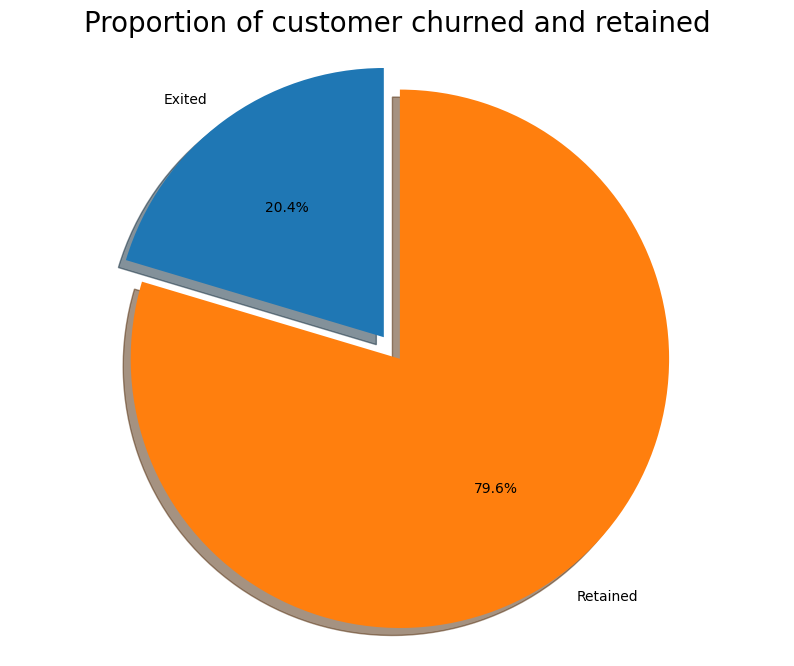
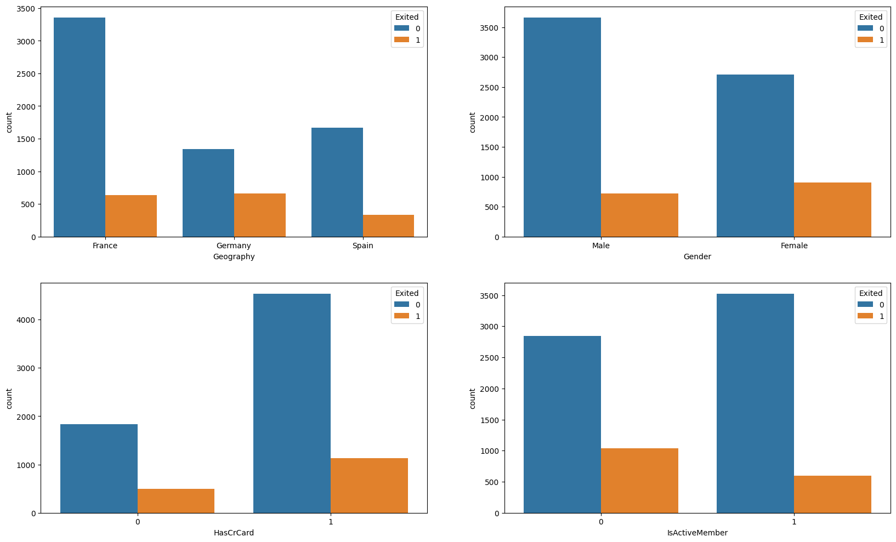
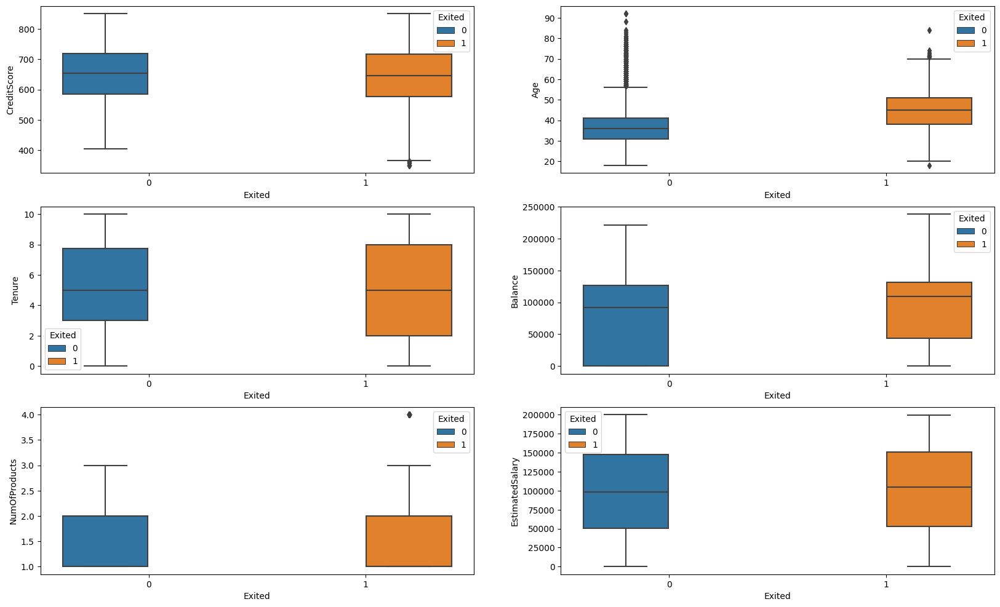
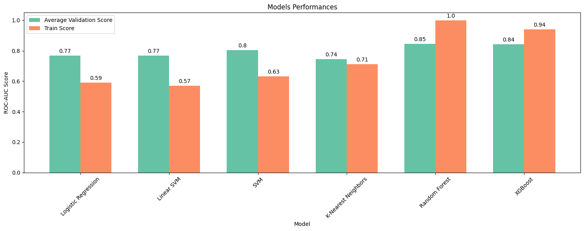
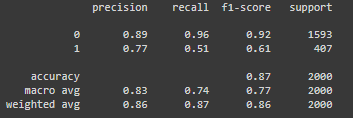
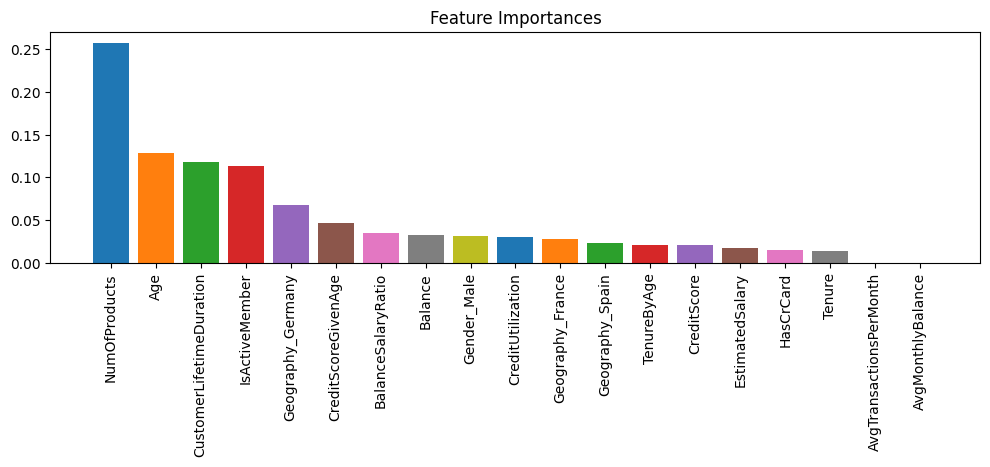

# 1. Churn_prediction
This represents a end-to-end machine learning project employing XGBoost for forecasting the likelihood of customer churn within a credit card service offered by a bank. The detection of potential churners aids in devising retention strategies, ensuring a sustainable revenue stream.

# 2. Business problem and objectives
We aim to accomplist the following for this study:

- Identify and visualize which factors contribute to customer churn:

- Build a prediction model that will perform the following:
  - Classify if a customer is going to churn or not.
  - Preferably and based on model performance, choose a model that will attach a probability to the churn to make it easier for customer service to target low hanging fruits in their efforts to prevent churn

# 3. Technologies and tools
The technologies and tools used were Python (Pandas, Numpy, Matplotlib, Seaborn, Scikit-Learn, Category-Encoders, Scikit-Optimize, Xgboost), Jupyter Notebook, Git and Github (version control), machine learning classification algorithms, statistics, and Google Colab.

# 4. Business Insights

1. Approximately 20% of the customers have experienced churn. Consequently, a plausible baseline model might involve predicting that 20% of customers will churn. Given that 20% represents a relatively small portion, it becomes imperative to ensure that the selected model excels at accurately identifying this 20%, as it is of significant interest to the bank to pinpoint and retain this group, even at the potential expense of accurately predicting the customers who will remain with the bank.
   


2. Although the majority of the data pertains to individuals from France, there exists an inverse relationship between the proportion of churned customers and the customer population in various regions. This suggests a potential issue within the bank, possibly linked to insufficient customer service resources in areas with fewer clients.

3. The percentage of female customers experiencing churn is notably higher than that of male customers.

4. Interestingly, a significant portion of the customers who churned held credit cards. However, given that the majority of customers have credit cards, this correlation could be coincidental.

5. As expected, inactive members exhibit a higher churn rate. Concerningly, the overall proportion of inactive members is quite substantial, indicating a potential need for implementing a program aimed at converting this group into active customers. Such an initiative could significantly reduce customer churn.



6. There is no notable disparity in the distribution of credit scores between customers who have been retained and those who have churned.

7. Older customers are churning at a higher rate than their younger counterparts, indicating potential differences in service preferences across age categories. This suggests that the bank may need to reassess its target market or revise its retention strategies for distinct age groups.

8. In terms of tenure, customers at both ends of the spectrum (those with minimal and extensive tenure) are more prone to churn compared to those with an average tenure.

9. Alarmingly, the bank is experiencing customer attrition among those with substantial account balances, which could impact the bank's available capital for lending.

10. Neither the choice of product nor salary level appears to significantly influence the likelihood of churn.



# 5. Modelling

- In this stage, my aim is to compare the performances of different models. To achieve this, I will employ stratified k-fold cross-validation to train each model and assess their ROC-AUC scores. Given the imbalanced nature of the target variable, accuracy is an unsuitable metric. Stratified k-fold cross-validation will address this issue by preserving the target class proportions in each fold.

- K-fold cross-validation is a machine learning technique that assesses a model's performance by dividing the dataset into K subsets, using K-1 for training and one for testing in an iterative manner. This approach helps estimate a model's generalization ability, mitigating the risk of overfitting and providing more reliable performance metrics.

- My goal here is to identify the best-performing model for subsequent hyperparameter tuning. To accomplish this, I will evaluate the models based on the highest average ROC-AUC validation scores and consider the trade-off between bias and variance.

- Once a model is selected, I will proceed with hyperparameter tuning. Hyperparameter tuning involves the selection of optimal hyperparameters for a machine learning model. These hyperparameters are set before the model is trained and directly impact its performance but are not learned from the data



The model's performance isn't in the best shape!

- **Recall (0.51)**: The model correctly identifies 51% of churners. In practical terms, when we examine the confusion matrix, it accurately predicts 209 out of 407 attrited customers.

- **Precision (0.77)**: Of all the customers predicted as churners, 77% of them indeed churn. In practical terms, according to the confusion matrix, out of 273 customers predicted as churners, 209 of them genuinely churn.

- **ROC-AUC (0.87)**: With an impressive ROC-AUC score of 0.87, the model exhibits medium discriminative capability between attrited and existing customers."



While ensemble models like XGBoost are typically less interpretable, we were able to gain insights and validate the estimator's outcomes by delving into feature importances. This analysis corroborated the findings from the Exploratory Data Analysis (EDA) phase, reaffirming that certain features distinctly contribute to distinguishing between attrited and existing customers.




# 6. Financial results

- I've estimated a foundational financial projection to evaluate the project's viability. While I lacked access to specific financial data for precise calculations, it's common for credit card companies to generate revenue through fees on outstanding balances—referred to as the total revolving balance—carried by cardholders monthly. Accordingly, I assumed a standard 18% fee for the bank and conducted the estimation accordingly.

- This calculation involved the difference between the gain from true positives (applying a 10% fee to outstanding balances as a retention strategy), the cost of retaining false positives (offering an 8% discount on outstanding balances), and the cost of false negatives churning (the complete 18% fee on outstanding balances that would have been collected). As a result, we arrived at an estimated gain of $4,089,987 !

- However, it's important to emphasize that this is a preliminary estimate designed to illustrate the potential advantages of applying the model. The actual outcome will depend on how the bank strategically implements retention strategies based on predicted churn probabilities. For instance, if the bank adopts a more conservative approach to mitigate costs related to false positives, it may focus on clients with higher churn probabilities, thus affecting the financial outcome.

- In conclusion, these excellent results demonstrate that our project has successfully achieved its objectives. The bank now has access to customer churn probabilities, empowering informed decision-making. This facilitates strategic retention efforts and effectively resolves the business problem at hand.

# 7. How to apply the model in your machine

**Prerequisites:**
Before getting started, make sure you have the following installed on your machine:

- **Python 3.11.4**
- **pip (Python package manager)**
- **Git (Version control tool)**
Once you have this installed, open a terminal on your local machine and run the following commands:

1. **Clone the repository**:
```
git clone https://github.com/allmeidaapedro/Churn_prediction.git
```
2. **Navigate to the cloned repository directory:**
```
cd Churn_prediction
```
3. **Create a virtual environment:**
```
python -m venv venv
```
4. **Activate the Virtual Environment:**
Activate the virtual environment used to isolate the project dependencies.
```
source venv/bin/activate  # On Windows, use 'venv\Scripts\activate'
```
5. **Install Dependencies:**
Use pip to install the required dependencies listed in the requirements.txt file.
```
pip install -r requirements.txt
```
6. **Run the Application:**
```
python application.py
```

# 8. Dataset link
The dataset was collected from kaggle.

Link: https://www.kaggle.com/datasets/adammaus/predicting-churn-for-bank-customers


